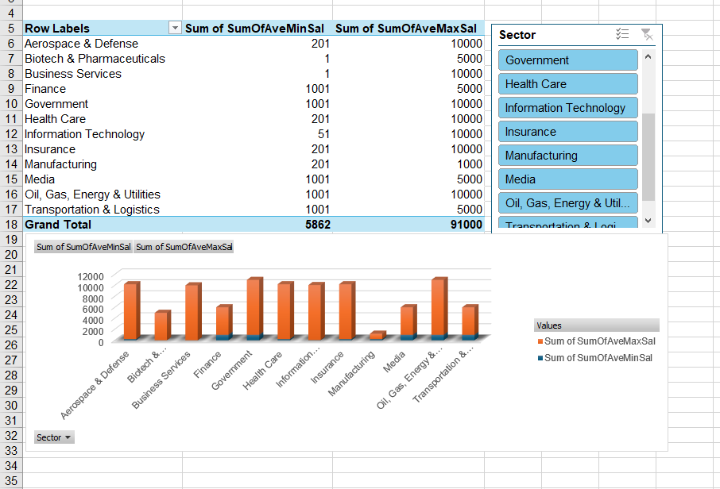

# Midterm-Task-3
- This portfolio is about creating an interactive Data Science Salary & Job Trends Dashboard using Excel. It analyzes job distribution, salary trends by role and company size, and sector-wise employment patterns through pivot tables, charts, slicers, and an optional map for visualization.
## Here's the Step by Step Process
- Use the given data  
   - Open the Worksheet on Uncleaned DS Jobs and the Transform Tables:  
     - Sal By Role  
     - Sal By State  
     - Sal By Size
-
-  Design the dashboard to highlight the following:  
   - State with the most Data Science jobs  
   - Job role with the highest average salary  
   - Company size that pays the highest salary  
   - Sector with the lowest & highest number of Data Science jobs  
   - Sector with the minimum & maximum average salary  

- Create a pivot table  
   - Use pivot tables to summarize data for sector jobs and salary (d & e) 

- Generate charts for reports  
   - Use bar, column, or pie charts to visualize salary trends and job distribution  

- Insert slicers for filtering  
   - Add slicers for role type, company size, and state to make the dashboard interactive  

- Add a map (optional)  
   - If available in your Excel version, insert a map visualization to show job distribution by state  

- Apply design & formatting  
   - Customize the colors, fonts, and layout to make the dashboard visually appealing  

- Complete the dashboard  
   - Ensure all required visuals and reports are included  
   - The slicers should be functional and interactive
 

# Screenshots During Analysis
- Sal by Size

- Sal by Role Type

- Sector by Average Sal

- Sector by Size

- State Name

US DATA JOBS

